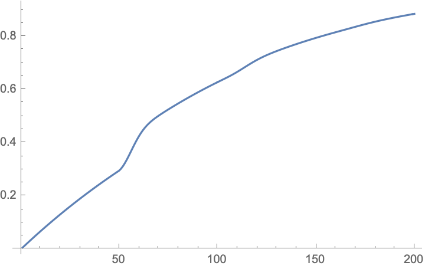

# 如何把W接上岛

> 被打上「石乐志」标签的文章是彻底属于“闲扯”的存在

感觉时间过去足够长了，把之前糊概率作业的小玩意拿出来。实际上东西不多，但是众所周知，作业能糊多长和干货量没有多大关系，和作业成绩关系就更不大了。

在W的池子开前算一波概率。

设$A_n$表示第$n$次抽到6星，$B_n$表示前$n-1$次都没有六星。得$P(A_n|B_n)$。

$$P(A_n|B_n)=\begin{cases}
0.02,\quad 0\leq n \leq 50 \\
0.02+0.02(n-50),\quad 50 < n \leq 99
\end{cases}
$$

同时

$$
\begin{aligned}
P(\overline {A_n}|B_n)&=1-P(A_n|B_n) \\
\end{aligned}
$$

省略一些没必要凑字数的套娃操作之后能得到递推式

$$
P(B_n)=P(B_{n-1})-P(A_{n-1}B_{n-1})
$$

同时有初始$P(B_1)=1$。

那么，X抽恰好抽到6星的概率为

$$
P\{X=k\}=P(A_kB_k)=P(A_k|B_k)P(B_k)
$$

已有公式构成递推

$$
\begin{aligned}
P\{X=k\}&=P(A_kB_k)=P(A_k|B_k)P(B_k) \\
P(B_n)&=P(B_{n-1})-P\{X=k-1\}
\end{aligned}
$$

当出现6星时，抽到W的概率为$35\%$。设抽到W的概率为$P_s$能够得到递推式

$$
\begin{aligned}
P_s(n)&=\sum_{1\leq k\leq n}P\{X=k\}(0.35+(1-0.35)P_s(n-k))\\
P_s(0)&=0
\end{aligned}
$$

直接套上CAS系统算。

这个图…说实话我觉得沉底了完全有可能…⚠️危⚠️

------

噫，好，我出了，这游戏又可以继续玩了。

说真的，单在手游的范围内讨论，mrfz的质量可以说是佼佼者了。不过何时能脱离单一的手游模式，做点别的呢。

